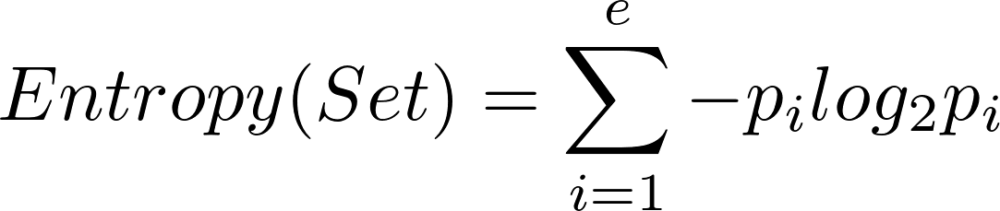
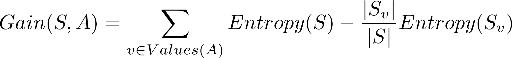

## Decision Tree Algorithm

This python application builds a decision tree from the flags dataset at the uci.edu datasets archive. http://archive.ics.uci.edu/ml/datasets/Flags. It creates a decision tree from the data and runs a few classification tests. This application is built for Dartmouth's Intro to Computation Neuroscience class, taught by Professor Granger.

## Installation

To run the visualization components of the program, you must install the PIL library, which can be installed by running `pip install image` on the terminal. You must have `pip` installed in order to retrieve PIL. You may find that pip does not install the PIL library properly, in which case you should run `python -m pip install image`, which will install the libraries in the folder of your default python interpreter.

## Algorithm Specifics

Again, this program implements the decision tree learning algorithm, which classifies instances of a dataset by traversing down a decision tree until reaching a leaf node, which provides the classification value. At each node, the classification algorithm tests an attribute of the instance, then traverses down the appropriate branch to the node which contains the value of the tested attribute. This step continues until we have reached a leaf node.

## Implementation

The algorithm is implemented in python, and the program runs in two steps: Build the decision tree, then classify instances of the data set. To run the program, run `python decisionTree.py` in terminal. The program parses the data in lenses.data.txt and then builds the decision tree. After, it classifies the instance [2,  1,  1,  2,  2], and prints the decision making at each step of the classification algorithm. If you copy a row from the lenses.data.txt file, remember to remove the first column as the first column marks a unique id for each row and is not part of the decision learning.

### Building the Decision Tree

The algorithms recursively constructs the decision tree from top to bottom, starting from the root, which looks at all of the rows in the dataset. At each iteration of the `buildTree` method, the algorithm calculates the attribute that would "best" split the current rows. In this dataset, each column represents a different attribute. The column number, the attribute represented at that column, and possible values, which are represented by numbers in the dataset, are listed below:
1. age of the patient: (1) young, (2) pre-presbyopic, (3) presbyopic
2. spectacle prescription:  (1) myope, (2) hypermetrope
3. astigmatic:     (1) no, (2) yes
4. tear production rate:  (1) reduced, (2) normal

And so, `buildTree` will determine whether to split the current data by tear production rate or age of the patient. After deciding which attribute to use, the algorithm then splits the data into disjoint sets, where each set shares the same value for that attribute. It then runs `buildTree` on each set and adds the resulting subtrees to the children array of the current decision node.

The "best" split of the data is determined by a statistical property called *information gain*. It measures how well a given attribute separates the training examples according to a target classification. The target classification in our case is whether the patient should be fitted with 1. hard contact lenses 2. soft contact lenses or 3. no lenses at all. Information gain relies on entropy, which measures the "impurity" of a collection of examples. More information on entropy can be found [here](https://en.wikipedia.org/wiki/Entropy).

Entropy is calculated by the equation:


where Set is the current dataset, e is the number of classifications (3 in our case), and pi is the proportion of rows in the dataset that fall under classification i. pi is calculated by (number of rows in classification) / number of rows.

Now, information gain is the expected *reduction* in entropy caused by dividing the samples according to the chosen attribute. That is, information gain measures the amount of information gained when provided the value of a single attribute. More information on information gain can be found [here](https://en.wikipedia.org/wiki/Information_gain_in_decision_trees)

The equation for information gain is:


where S is the current set, A is the selected attribute, Entropy(S) is the entropy of the current set, Values(A) are all the possible values of attribute A, and Sv is the set within S that contains the current value v.

Armed with the information gain equation, the algorithm iterates through every possible attribute that could divide the current dataset, keeps track of which attribute maximizes Gain(S,A), and then selects that attribute as the criteria for the current node. It then divides the data set by that attribute and creates children nods that  are assigned a corresponding value from Values(A).

If there is no attribute that divides the set further, then the node becomes a leaf node, which is marked by an attribute `self.results`. This is a map between the classification and the rows that have reached this node. `self.results` should contain only one entry because leaf nodes should make one, final classification.

More information on Decision Tree Learning can be found [here](https://www.cs.princeton.edu/courses/archive/spring07/cos424/papers/mitchell-dectrees.pdf)

## Data set

As said above, the data set is a collection of rows, where each row represents a patient. Each row contains the following information:
1. age of the patient: (1) young, (2) pre-presbyopic, (3) presbyopic
2. spectacle prescription:  (1) myope, (2) hypermetrope
3. astigmatic:     (1) no, (2) yes
4. tear production rate:  (1) reduced, (2) normal

The patients are divided into 3 classes:
 1 : the patient should be fitted with hard contact lenses,
 2 : the patient should be fitted with soft contact lenses,
 3 : the patient should not be fitted with contact lenses.

This is a very simple data set where the attribute are all categorical, not numerical, and there are 3 possible classifications.

## Results

The resulting tree was structured like so:

```
Check Attribute: Tear Production Rate
 if Reduced Class: Not Fitted
 if Normal Check Attribute: Astigmatic
   if No Check Attribute: Age of Patient
     if Young Class: Soft
     if Pre-presbyopic Class: Soft
     if Presbyopic Check Attribute: Spectacle Prescription
       if Myope Class: Not Fitted
       if Hypermetrope Class: Soft
   if Yes Check Attribute: Spectacle Prescription
     if Myope Class: Hard
     if Hypermetrope Check Attribute: Age of Patient
       if Young Class: Hard
       if Pre-presbyopic Class: Not Fitted
       if Presbyopic Class: Not Fitted
```

It was difficult to draw an actual tree. Nodes that are directly indented under another represent direct children. For example, the root's criteria (selected attribute that divides the set) is Tear Production Rate, and its children are two nodes, where one is a leaf node (if reduced the classification is Not Fitted), and the other is a decision node that checks the Astigmatic attribute.

## Conclusions

The contact lenses data provided a great data set for decision learning because its attributes were categorical and there were a limited number of classifications. This meant that at every decision node, the decision learning algorithm simply created a child for every possible value. If the values were real numbers, the decision learning algorithm would be much more complicated, and would have to accommodate ranges of numbers in its decision making. Furthermore, the classifications were discrete and likewise unambiguous. If the data set contained real numbers or non-categorical attributes and classifications, decision learning would prove too time and space intensive. Other algorithms would work better in those cases.

Decision learning conforms to the characteristics of ANNs we learned in class. The tree building algorithm searches through a space of possible decision trees and evaluates those trees by performing a hill-climbing search to maximize information gain. Because each classification is discrete, the space of possible decision trees is guaranteed to contain a tree that correctly matches the inputs (based on the training data) to correct classifications.

Because the decision learning algorithm computes information gain on its current node, and not on the entire dataset, at every iteration, it cannot determine the number of alternative decision trees, or compete amongst different decision trees. It does not consider other possible decision trees that may be more efficient.

That being said, decision learning is great because it is simple to build, and it is very easy for a human to track the decision making process. Furthermore, so long as new the attribute values of new inputs remain within the range of values that were used to train the decision tree, the decision tree classification method will produce highly accurate results.

It is important to note that although it may be less efficient than other algorithms, it is possible to augment the decision learning algorithm so that it can handle real, and not only categorical, attributes and classifications. One way to measure information gain is to sort the examples according to the real-number attribute, check instances where adjacent continuous values have different classifications, calculate the average of the two values, check the information gain from selecting an average as a threshold. In this decision node, the data will be split by rows that contain a value (for the specified attribute) greater than the threshold, and those that contain a value less than or equal to the threshold.
